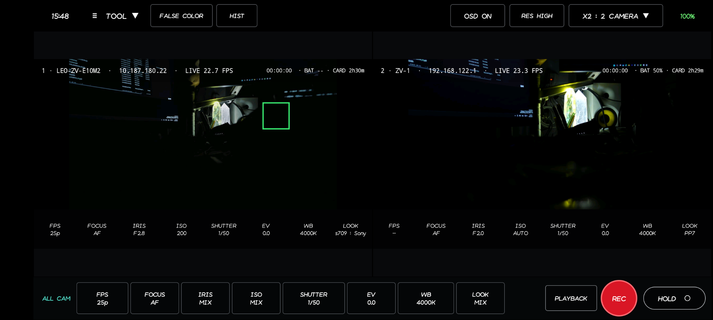
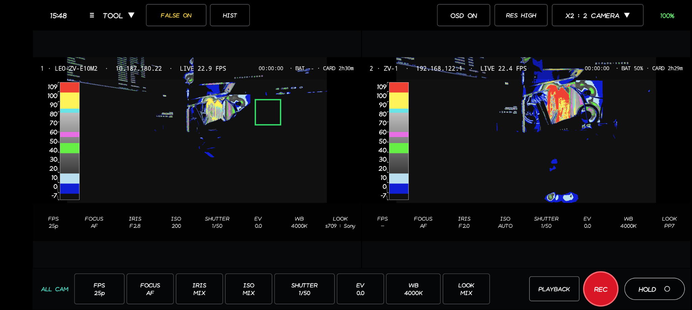
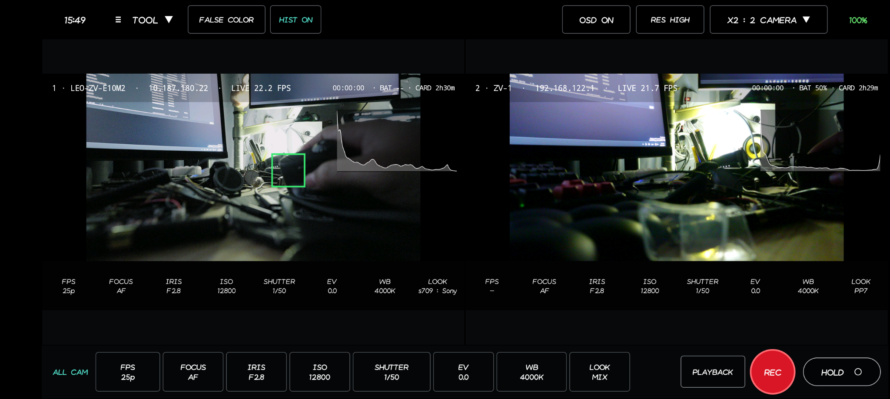
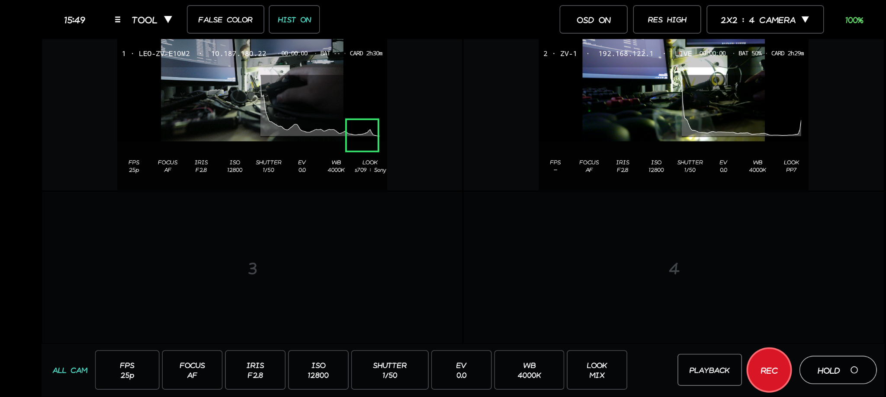
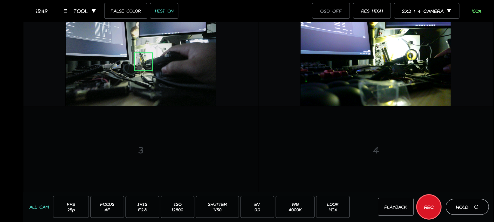
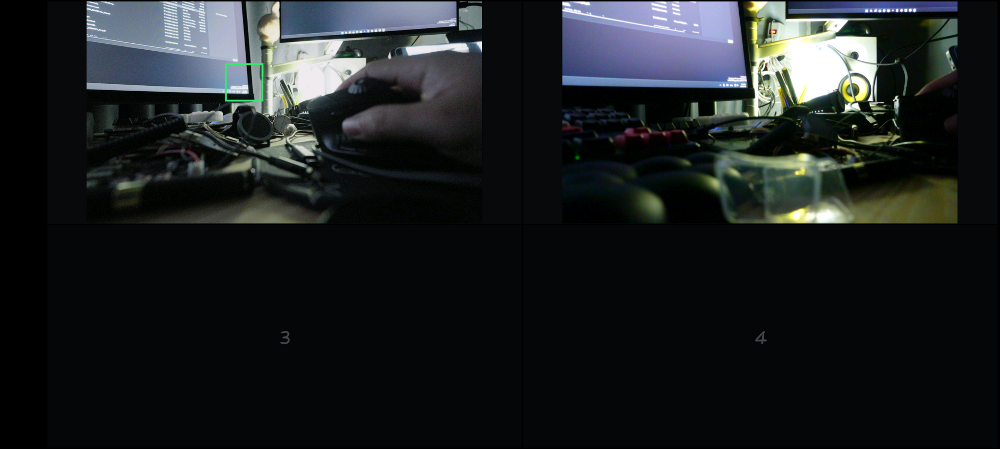
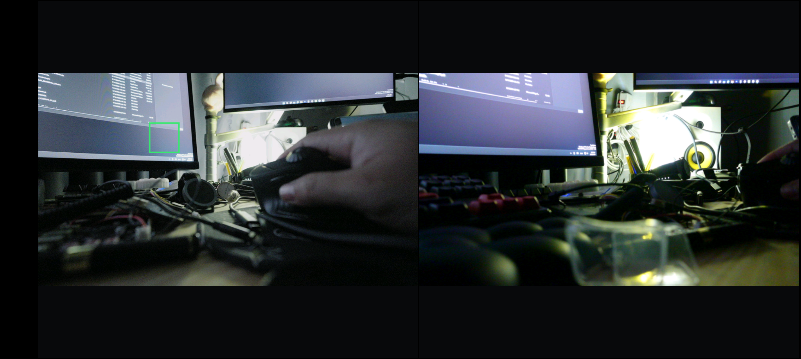

# Sony Multiple Monitor V1.0.0

Android multi-camera monitor and remote-control application for Sony cameras over Wi-Fi using Sony PTP/IP.

This repository is the **Sony Multiple Monitor V1.0.0** source release. It is the consolidated production baseline of the application and no longer uses development-version branding in the user interface or release documentation.

> **Android Studio README images:** the screenshots are embedded with HTML `` tags and stored beside `README.md`. Open `README.md`, then select **Preview** or **Editor and Preview** in the Markdown editor.

---

# Introduction

## Overview

Sony Multiple Monitor V1.0.0 is designed for monitoring and controlling up to four Sony cameras from a single Android device. The application combines multi-camera Live View, production controls, camera settings, recording control, Playback navigation, exposure tools, and automatic camera-to-monitor layout in one operator interface.

The implementation has been hardware-tested during development with:

- Sony ZV-1
- Sony ZV-E10M2

Other Sony cameras may work when they expose compatible Sony PTP/IP properties and controls. Sony property IDs, enum values, and physical-button capabilities can vary by camera model and firmware.

## Interface gallery

### Main two-camera monitor

The standard operator view keeps camera status, exposure controls, ALL CAM settings, Playback, REC, and HOLD available around the Live View area.

<p align="center">
  
</p>

### False Color

False Color can be enabled for all visible camera tiles while retaining the exposure legend and production controls.

<p align="center">
  
</p>

### Histogram

Histogram mode overlays a luminance graph on each active camera tile without interrupting Live View.

<p align="center">
  
</p>

### Four-camera 2x2 layout

The `2x2 : 4 Camera` layout keeps four physical monitor slots visible. Connected cameras occupy their assigned/automatic slots while unused slots remain available.

<p align="center">
  
</p>

### OSD OFF

OSD can be disabled for a cleaner picture while retaining the main application controls.

<p align="center">
  
</p>

## Main features

### Multi-camera Live View

- Up to 4 camera monitor slots.
- Automatic Sony camera discovery on the active Wi-Fi/AP network.
- The app opens with a 4-frame `2x2` monitor before cameras are discovered.
- After cameras connect, Automatic mode selects the layout from the connected-camera count:
  - `x1 : 1 Camera`
  - `x2 : 2 Camera`
  - `2+1 : 3 Camera`
  - `2x2 : 4 Camera`
- Camera assignment defaults to **Automatic**.
- Any slot can still be manually assigned to a specific connected camera from TOOL.

### Full-screen monitor gesture

The monitor has a fast gesture for removing the operator controls from the image area:

- **Swipe up** on the monitor to hide the top and bottom control bars and show the camera grid full screen.
- **Swipe down** to restore the normal control bars.
- Android system bars remain in immersive/full-screen mode in both states.

This gesture does not disconnect cameras or restart Live View; it only changes the monitor UI visibility.

#### Full-screen examples

With the control bars hidden, the monitor grid uses the available application area for the camera feeds.

<p align="center">
  
</p>

Two-camera monitoring can also be viewed with the operator bars hidden. Swipe down to restore the controls.

<p align="center">
  
</p>

### Sony PTP/IP control

The active transport uses Sony PTP/IP on TCP port `15740` with the existing command/event session and Sony SDIO handshake.

Important operations used by the application include:

- `0x9201` - Sony SDIO session phase
- `0x9202` - Sony capability information
- `0x9205` - Set extended property
- `0x9207` - Sony control operation
- `0x9209` - Extended property snapshot
- `0xC203` / `0x4006` - Property-change events
- `0x1009` with object `0xFFFFC002` - Sony Live View object

### Recording

- Per-camera REC state/control.
- ALL CAM REC/STOP.
- HOLD mode for preventing accidental setting changes.
- Command-driven REC operator feedback.
- Model-aware Sony REC button polarity.

### Camera settings

The available controls are resolved from each camera's advertised Sony properties. The current application supports the production controls used by the monitor workflow, including:

- Focus mode
- Iris
- ISO
- Shutter
- EV
- White Balance
- Creative Look / Picture Profile labels
- Touch focus and touch-focus cancel

EV follows the application exposure rule: EV is adjustable when at least one of ISO, Iris, or Shutter is Auto; EV is locked when all three are Manual. The current EV UI range is `-2.0 EV` to `+2.0 EV`.

### Playback

Normal ALL CAM transport:

`PLAYBACK   REC   HOLD`

Playback transport:

`LIVE VIEW   <   PLAY   >`

Behavior:

- `PLAYBACK` enters camera Playback mode.
- While Playback is active, the same button becomes `LIVE VIEW`.
- `<` selects the previous file.
- `>` selects the next file.
- `PLAY` keeps the same text, color, and appearance at all times.
- Repeated `PLAY` taps toggle play/pause on the camera.
- On ZV-E10M2, PLAY/PAUSE uses the proven physical `D309 ENTER 0x0005` path.
- Previous/Next use the Sony physical LEFT/RIGHT camera-button path.

The PLAY button does not depend on movie-playing-state polling.

### Monitoring tools

- OSD ON/OFF
- False Color
- Histogram
- High/Low monitor render profile
- Camera FPS/status overlay
- Battery and card remaining telemetry when exposed by the camera

## Architecture

| Component | Responsibility |
|---|---|
| `MainActivity.kt` | Main monitor UI, discovery, layout, ALL CAM controls, full-screen swipe gesture |
| `CameraTileView.kt` | Per-camera Live View tile, OSD, REC border, False Color, Histogram |
| `SonyCameraSession.kt` | Per-camera lifecycle and Live View/control coordination |
| `SonyPtpLiveViewController.kt` | Sony PTP/SDIO protocol, properties, REC, Playback, camera settings |
| `SonyPtpIpClient.kt` | Low-level PTP/IP command/event transport |
| `SonyPtpDiscovery.kt` | Sony PTP/IP camera discovery |
| `SonyDeviceDescription.kt` | Sony device-description parsing |
| `SonyExposureLogic.kt` | EV Auto/Manual gating logic |
| `SonyCameraValueFormatter.kt` | Sony property-to-UI value formatting |
| `tools/*.kt` | Protocol and regression self-tests |

## Stable transport rules

The following rules are intentionally preserved in V1.0.0:

- Do not reconnect PTP periodically just to refresh camera settings.
- Do not insert periodic bulk property reads into the active Live View frame loop.
- Use Sony property-change events for normal setting synchronization.
- A Sony physical-button action must complete `DOWN -> UP`.
- Do not blindly repeat a button `DOWN` after an uncertain network timeout; the camera may already have accepted it.
- Keep ZV-E10M2 Playback PLAY/PAUSE routed through `D309 ENTER 0x0005`.
- Resolve logical setting values independently for each camera instead of broadcasting another body's raw enum value.

---

# Tutorial

## 1. Requirements

Recommended development environment:

- Android Studio
- JDK 17 or newer
- Android SDK Platform 35
- Android 9 / API 28 or newer physical device
- Wi-Fi/AP network that permits communication between wireless clients

Project configuration:

- `compileSdk = 35`
- `targetSdk = 35`
- `minSdk = 28`
- Android Gradle Plugin `9.4.0`
- Gradle distribution `9.6.1`
- Java source/target compatibility 17
- Application ID: `com.example.sonymultilive`
- Version name: `1.0.0`

The application ID is intentionally retained so an existing installation can be updated without changing the Android package identity.

## 2. Open and build the project

1. Extract the source ZIP.
2. Open Android Studio.
3. Choose **File -> Open**.
4. Select the project root containing `settings.gradle.kts`.
5. Allow Gradle sync to complete.
6. Install Android SDK 35 if Android Studio requests it.
7. Connect a physical Android device with USB debugging enabled.
8. Run the `app` module.

The source includes Gradle wrapper scripts and wrapper properties. If command-line wrapper execution is required and the wrapper JAR is not present in your environment, regenerate the standard Gradle wrapper JAR first.

## 3. Prepare the Sony cameras

For each camera:

1. Enable the Sony network/remote-control mode required for PTP/IP operation.
2. Connect the camera and Android device to the same Wi-Fi access point or hotspot.
3. Wait until the camera receives an IP address.
4. Disable AP/client isolation on the network.
5. Ensure TCP port `15740` is reachable between Android and the camera.

For multi-camera use, every camera must be reachable from the Android device over the same active route.

## 4. Start the app and discover cameras

At launch:

1. The app initially displays the `2x2 : 4 Camera` monitor canvas.
2. Camera assignment is **Automatic** for all four slots.
3. The app starts camera discovery automatically shortly after the UI opens.
4. Successfully connected cameras start Live View.
5. The grid automatically changes to match the number of connected cameras.

To scan manually, open:

**TOOL -> SCAN · Wi-Fi/AP + PTP**

## 5. Choose the monitor layout

Tap the layout button in the top control bar.

Available choices:

- `x1 : 1 Camera`
- `x2 : 2 Camera`
- `2+1 : 3 Camera`
- `2x2 : 4 Camera`

A fresh scan returns slot assignment to the Automatic workflow.

## 6. Use full-screen monitor mode

To maximize the camera images without leaving the Live View session:

1. **Swipe up** vertically on the monitor area.
2. The top and bottom application control bars are hidden.
3. The camera grid expands into the available monitor area.
4. **Swipe down** vertically to restore the top and bottom controls.

A swipe of roughly 70 dp or more is treated as the full-screen gesture. System status/navigation bars remain hidden in immersive mode, so the gesture only toggles the Sony Multiple Monitor control bars.

## 7. Assign cameras to specific slots

Open:

**TOOL -> ASSIGN CAMERAS TO SLOTS**

Each slot offers:

- `Automatic`
- any currently connected camera

Physical slot positions are:

- Slot 1 - Top Left
- Slot 2 - Top Right
- Slot 3 - Bottom Left
- Slot 4 - Bottom Right

Leave slots on **Automatic** unless a fixed production layout is required.

## 8. Use monitor tools

### OSD

Use `OSD ON/OFF` to show or hide camera/monitor overlays.

### False Color

Use `FALSE COLOR` for exposure visualization.

### Histogram

Use `HIST` to show or hide the luminance histogram.

### Resolution profile

Use `RES HIGH` / `RES LOW` to change the Android monitor render profile between the high and low display modes.

## 9. Change camera settings

Use the camera setting controls in the monitor interface. The application resolves values against the properties advertised by each camera.

For ALL CAM changes, the selected logical value is mapped independently for each connected camera before the command is sent. This avoids cross-model enum mismatches between bodies such as ZV-1 and ZV-E10M2.

## 10. Record with ALL CAM

Normal transport:

`PLAYBACK   REC   HOLD`

- Tap `REC` to start recording on the connected cameras.
- The REC control changes to STOP according to the command state.
- Tap `STOP` to stop recording.
- Use `HOLD` to lock setting interactions when required.

## 11. Use Playback

### Enter Playback

Tap `PLAYBACK`.

The transport becomes:

`LIVE VIEW   <   PLAY   >`

### Select files

- `<` - previous file
- `>` - next file

### Play and pause

Tap `PLAY` once to play the selected movie.

The button intentionally remains labeled `PLAY` and does not change color or appearance.

Tap the same `PLAY` button again to pause. Tap it again to resume.

### Return to Live View

Tap `LIVE VIEW`.

The cameras leave Playback mode, Live View restarts, and the transport returns to:

`PLAYBACK   REC   HOLD`

## 12. Reconnect cameras

If a camera connection drops, open:

**TOOL -> RECONNECT CAMERAS**

This is also the explicit recovery path if a camera is intentionally held in Playback and Live View must be restored.

## 13. Troubleshooting

### Camera is not discovered

Check that:

- Android and camera are on the same reachable Wi-Fi/AP network.
- Sony remote/network mode is enabled.
- The camera has a valid IP address.
- AP/client isolation is disabled.
- TCP `15740` is reachable.

Then run **TOOL -> SCAN · Wi-Fi/AP + PTP** again.

### Live View stops after entering Playback

This is expected. Sony Live View object `0xFFFFC002` is intentionally stopped while the physical camera is in Playback mode. Tap `LIVE VIEW` to return to monitoring.

### Previous/Next appears held continuously

The Sony physical-button path must complete `DOWN -> UP`. A network interruption between those transactions can leave the camera behaving as though a direction button is held. Reconnect the camera before continuing; do not add blind DOWN retries.

### PLAY does not work on ZV-E10M2

Retain the working physical-center path:

- Control property: `D309`
- ENTER button ID: `0x0005`
- DOWN: `0x00050002`
- UP: `0x00050001`

## 14. Run regression tests

The JVM protocol self-tests are under `tools/`.

Example stable transport test:

```bash
kotlinc \
  app/src/main/java/com/example/sonymultilive/SonyPtpIpClient.kt \
  app/src/main/java/com/example/sonymultilive/SonyPtpLiveViewController.kt \
  tools/PtpStableTransportSelfTest.kt \
  -include-runtime -d sony-monitor-test.jar

java -jar sony-monitor-test.jar
```

Important regression tests include:

- `PtpStableTransportSelfTest.kt`
- `PtpPlaybackZve10m2CenterSelfTest.kt`
- `PtpPlaybackTileTransportSelfTest.kt`
- `PtpC203BulkSnapshotSelfTest.kt`
- `PtpCriticalDynamicRawScanSelfTest.kt`
- `FocusCompactSelfTest.kt`

See `TEST_REPORT.md` for the V1.0.0 validation summary.

## 15. Source maintenance

Sony Multiple Monitor V1.0.0 is the stable release baseline. Future changes should be small, isolated, and covered by the existing PTP regression tests.

Avoid replacing the working Sony PTP/IP + `0xFFFFC002` Live View path unless a replacement has been validated on the target camera hardware.
